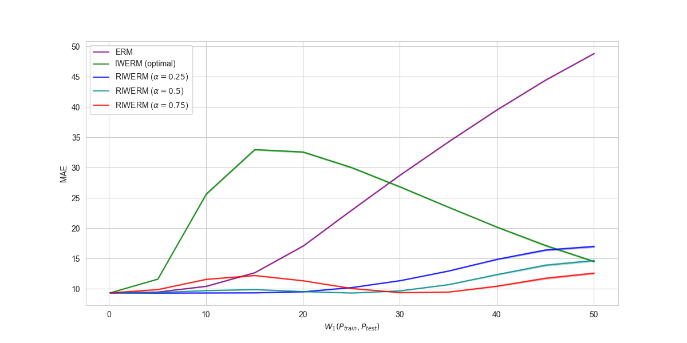

# Benchmarks

## Regression for the number of likes

* task type: regression
* shift type: target shift
* shift metric: wasserstein distance
* train/test sample size
  * train sample size: 100000
  * test sample size: 100000
* input/output dimension
  * input dimension: 25
  * output dimension: 1
* number of trials: 20

### Ordinal Empirical Risk Minimizations

* hyperparameters: All hyperparameters are default settings of the [scikit-learn](https://scikit-learn.org/stable/index.html).
* source code is available [here](bechmarks/numlikes_tabular.py).

| Models            | W=0            | W=5            | W=10           | W=15           | W=20           | W=25           | W=30            | W=35           | W=40           | W=45           | W=50           |
|-------------------|----------------|----------------|----------------|----------------|----------------|----------------|----------------|----------------|----------------|----------------|----------------|
| Linear Regression | 9.364(±0.027)  | 9.495(±0.033)  | 10.446(±0.048) | 12.689(±0.053) | 17.101(±0.060) | 23.016(±0.056) | 28.800(±0.058) | 34.292(±0.047) | 39.564(±0.050) | 44.462(±0.050) | 48.844(±0.056) |
| RANSAC Regression | 10.394(±0.273) | 12.408(±1.273) | 15.934(±1.223) | 19.586(±1.161) | 23.700(±1.958) | 28.212(±1.398) | 33.012(±1.076) | 37.573(±1.600) | 42.726(±1.334) | 47.380(±1.358) | 53.038(±0.890) |
| Huber Regression  | 30.347(±0.939) | 30.428(±0.816) | 31.025(±0.712) | 32.496(±0.598) | 35.211(±0.475) | 38.747(±0.463) | 42.474(±0.391) | 46.224(±0.396) | 49.836(±0.302) | 53.244(±0.268) | 56.524(±0.221) |
| TheilSen Regressor| 9.968(±0.092)  | 10.130(±0.077) | 11.117(±0.061) | 13.423(±0.087) | 17.779(±0.074) | 23.499(±0.111) | 29.136(±0.122) | 34.476(±0.106) | 39.661(±0.102) | 44.465(±0.105) | 48.838(±0.102) |
| Decision Tree     | 12.828(±0.059) | 14.293(±0.096) | 16.671(±0.124) | 19.462(±0.197) | 22.182(±0.305) | 25.387(±0.251) | 29.131(±1.396) | 33.152(±0.396) | 37.046(±0.166) | 41.240(±0.325) | 44.959(±0.498) |

### Importance Weighted Empirical Risk Minimizations
* hyperparameters:
  * model hyperparameters are default settings of the [scikit-learn](https://scikit-learn.org/stable/index.html).
  * sample weights are calculated by optimal probability density functions.
* Comparison methodologies
  * ERM: Linear Regression
  * IWERM: [Importance Weighted ERM [1]](https://www.sciencedirect.com/science/article/pii/S0378375800001154?casa_token=FNmKLAni55IAAAAA:5mrfwarhzqhRTZ6j9Ny20vSTaSU1nnK3lVSOYlWjCJm8oZXBqKdOTYarDtQDkJlTgrqrf1bXcf2V)
  * RIWERM: [Relative Importance Weighted ERM [2]](https://ieeexplore.ieee.org/abstract/document/6797650)
* source code is available [here](bechmarks/numlikes_tabular_iwerm.py).

| Models            | W=0            | W=5            | W=10           | W=15           | W=20           | W=25           | W=30            | W=35           | W=40           | W=45           | W=50           |
|-------------------|----------------|----------------|----------------|----------------|----------------|----------------|----------------|----------------|----------------|----------------|----------------|
| Linear Regression | 9.364(±0.027)  | 9.495(±0.033)  | 10.446(±0.048) | 12.689(±0.053) | 17.101(±0.060) | 23.016(±0.056) | 28.800(±0.058) | 34.292(±0.047) | 39.564(±0.050) | 44.462(±0.050) | 48.844(±0.056) |
| IWERM (optimal) | 9.364(±0.027)  | 11.633(±0.049)  | 25.678(±0.128) | 32.993(±0.123) | 32.589(±0.121) | 30.022(±0.117) | 26.834(±0.119) | 23.478(±0.091) | 20.197(±0.103) | 17.166(±0.141) | 14.528(±0.106) |
| RWERM (alpha=0.25) | 9.364(±0.027)  | 9.319(±0.029)  | 9.348(±0.044) | 9.367(±0.040) | 9.539(±0.035) | 10.237(±0.050) | 11.378(±0.048) |12.967(±0.055) | 14.895(±0.097) | 16.428(±0.141) | 17.007(±0.147) |
| RWERM (alpha=0.5) | 9.364(±0.027)  | 9.414(±0.026)  | 9.734(±0.044) | 9.901(±0.044) | 9.573(±0.035) | 9.338(±0.040) | 9.690(±0.041) |10.722(±0.054) | 12.378(±0.106) | 13.923(±0.154) | 14.685(±0.153) |
| RWERM (alpha=0.75) | 9.364(±0.027)  | 9.903(±0.025)  | 11.594(±0.051) | 12.222(±0.061) | 11.355(±0.053) | 10.086(±0.040) | 9.397(±0.038) |9.493(±0.042) | 10.465(±0.095) | 11.765(±0.146) | 12.607(±0.143) |

## References
- [1] Shimodaira, Hidetoshi. "Improving predictive inference under covariate shift by weighting the log-likelihood function." Journal of statistical planning and inference 90.2 (2000): 227-244.
- [2] Yamada, Makoto, et al. "Relative density-ratio estimation for robust distribution comparison." Neural computation 25.5 (2013): 1324-1370.
